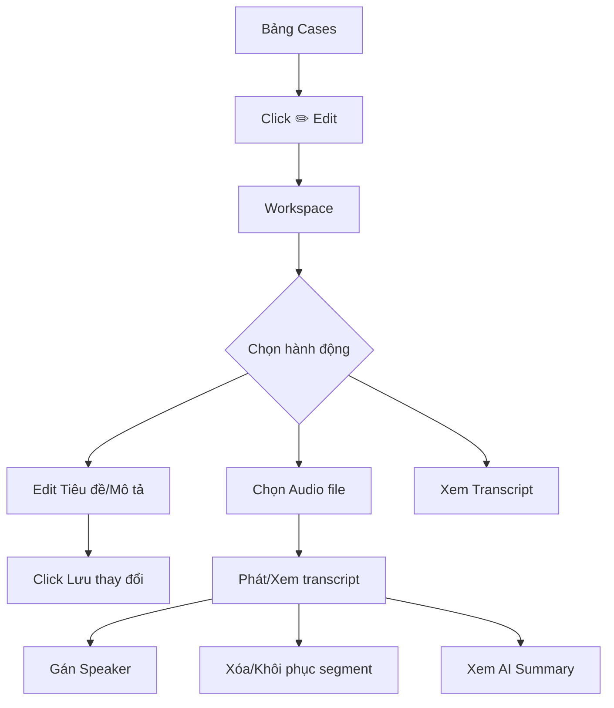
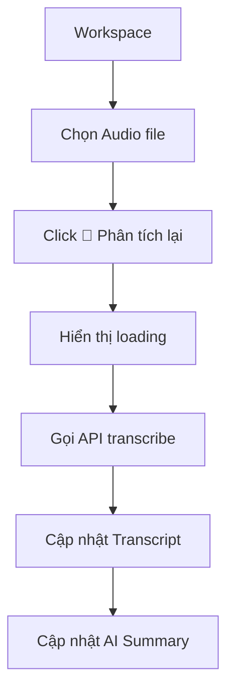

# SPEXOR UI - Function List & User Flow

## Function List chi tiết

### 1. Navigation & UI Core

| Function | Mô tả |
|----------|-------|
| `showPage(pageName)` | Chuyển đổi giữa các trang |
| `openModal(modalId)` | Mở modal dialog |
| `closeModal(modalId)` | Đóng modal dialog |
| `showToast(type, title, message)` | Hiển thị thông báo toast |

---

### 2. Case Management (Sự vụ)

| Function | Mô tả |
|----------|-------|
| `showCaseModal(caseId)` | Mở modal thêm/sửa sự vụ |
| `saveCase()` | Lưu sự vụ mới hoặc cập nhật |
| `viewCase(caseId)` | Xem chi tiết sự vụ |
| `deleteCase(caseId)` | Xác nhận xóa sự vụ |
| `openCaseWorkspace(caseId)` | Mở workspace chỉnh sửa |
| `saveCaseFromWorkspace()` | Lưu thay đổi từ workspace |
| `renderCasesTable()` | Render bảng danh sách |
| `handleCaseAudioFiles(files)` | Xử lý upload audio |
| `removeCaseAudioFile(fileName)` | Xóa file audio khỏi list |

---

### 3. User Management (Người dùng)

| Function | Mô tả |
|----------|-------|
| `showUserModal(userId)` | Mở modal thêm/sửa user |
| `saveUser()` | Lưu user |
| `deleteUser(userId)` | Xóa user |
| `renderUsersGrid()` | Render grid users |

---

### 4. Speaker Management (Người nói)

| Function | Mô tả |
|----------|-------|
| `showSpeakerModal(speakerId)` | Mở modal thêm/sửa speaker |
| `saveSpeaker()` | Lưu speaker |
| `renderSpeakersGrid()` | Render grid speakers |
| `handleVoiceSamples(files)` | Upload voice samples |
| `renderVoiceSamplesList()` | Render danh sách samples |
| `toggleVoiceSample(index)` | Phát/Dừng voice sample |
| `removeVoiceSample(index)` | Xóa voice sample |
| `clearVoiceSamples()` | Xóa tất cả samples |
| `formatDuration(seconds)` | Format thời lượng mm:ss |

---

### 5. Alert Word Management (Từ khóa cảnh báo)

| Function | Mô tả |
|----------|-------|
| `showAlertWordModal(wordId)` | Mở modal thêm/sửa từ khóa |
| `saveAlertWord()` | Lưu từ khóa |
| `deleteAlertWord(wordId)` | Xóa từ khóa |
| `toggleAlertWord(wordId)` | Bật/tắt từ khóa |
| `renderAlertWordsTable()` | Render bảng từ khóa |

---

### 6. Replacement Word Management (Từ thay thế)

| Function | Mô tả |
|----------|-------|
| `showReplacementModal(repId)` | Mở modal thêm/sửa |
| `saveReplacement()` | Lưu từ thay thế |
| `deleteReplacement(repId)` | Xóa từ thay thế |
| `renderReplacementsTable()` | Render bảng |

---

### 7. Audio & Transcript

| Function | Mô tả |
|----------|-------|
| `jumpToTime(seconds)` | Nhảy đến thời điểm audio |
| `reanalyzeAudio(fileId, event)` | Phân tích lại transcript |
| `deleteAudioFile(fileId, event)` | Xóa file audio |
| `deleteSegment(segmentId)` | Xóa đoạn transcript |
| `restoreAllSegments()` | Khôi phục đoạn đã xóa |
| `updateRestoreBar()` | Cập nhật thanh restore |

---

### 8. AI Summary

| Function | Mô tả |
|----------|-------|
| `changeSummaryLevel(level)` | Đổi mức độ tóm tắt |
| `getLevelText(level)` | Lấy text mức độ |
| `copySummary()` | Copy summary vào clipboard |
| `scrollToSummary()` | Cuộn đến phần summary |

---

### 9. Transcript Speaker Assignment

| Function | Mô tả |
|----------|-------|
| `populateSpeakerDropdowns()` | Populate dropdown speakers |
| `assignSpeaker(selectElement, tempId)` | Gán speaker cho transcript |
| `updateSpeakerDisplay(tempId, speaker)` | Cập nhật display |
| `changeSpeakerAssignment(tempId)` | Đổi speaker assignment |
| `showAddSpeakerToTranscript()` | Thêm speaker mới vào transcript |
| `removeSpeakerFromTranscript(tempId)` | Xóa speaker khỏi transcript |

---

### 10. Notifications

| Function | Mô tả |
|----------|-------|
| `getTimeAgo(timestamp)` | Format thời gian "X phút trước" |
| `getNotificationIcon(type, action)` | Lấy icon theo loại |
| `filterNotifications()` | Lọc thông báo |
| `resetNotificationFilters()` | Reset bộ lọc |
| `renderNotifications()` | Render danh sách |
| `markNotificationAsRead(id)` | Đánh dấu đã đọc |
| `markAllNotificationsAsRead()` | Đánh dấu tất cả đã đọc |
| `updateNotificationBadge()` | Cập nhật badge số lượng |

---

### 11. Important Events

| Function | Mô tả |
|----------|-------|
| `openImportantEventsConfig()` | Mở panel cấu hình |
| `closeImportantEventsConfig()` | Đóng panel |
| `saveImportantEvents()` | Lưu cấu hình |
| `resetImportantEvents()` | Reset về mặc định |
| `isImportantEvent(notification)` | Kiểm tra sự kiện quan trọng |

---

### 12. Utility

| Function | Mô tả |
|----------|-------|
| `formatFileSize(bytes)` | Format dung lượng file |
| `confirmDelete()` | Xác nhận xóa |
| `editFromView()` | Chuyển sang edit mode |

---

## User Flow Diagrams

### Flow 1: Tạo sự vụ mới

```mermaid
flowchart TD
    A[Dashboard] --> B[Click "+ Thêm sự vụ"]
    B --> C[Modal Thêm sự vụ]
    C --> D[Nhập thông tin cơ bản]
    D --> E[Upload file audio]
    E --> F[Cấu hình phân tích]
    F --> G[Click "Lưu sự vụ"]
    G --> H[Toast thành công]
    H --> I[Cập nhật bảng Cases]
```

### Flow 2: Làm việc với Workspace



### Flow 3: Thêm người nói với Voice Sample

```mermaid
flowchart TD
    A[Quản lý người nói] --> B[Click "+ Thêm người nói"]
    B --> C[Modal Thêm]
    C --> D[Nhập thông tin]
    D --> E[Upload Voice Samples]
    E --> F[Nghe thử ▶️]
    F --> G{OK?}
    G -->|Không| H[Xóa 🗑️]
    H --> E
    G -->|OK| I[Click "Lưu người nói"]
```

### Flow 4: Cấu hình sự kiện quan trọng

```mermaid
flowchart TD
    A[Trang Thông báo] --> B[Click "⭐ Sự kiện quan trọng"]
    B --> C[Panel cấu hình]
    C --> D[Check/Uncheck loại sự kiện]
    D --> E[Click "Xong"]
    E --> F[Render lại Notifications]
    F --> G[Hiển thị badge ⭐ Quan trọng]
```

### Flow 5: Phân tích lại Audio



---

## State Management

```javascript
const state = {
    currentPage: 'dashboard',      // Trang hiện tại
    editingItem: null,             // ID item đang edit
    deleteCallback: null,          // Callback xóa
    currentCaseId: null,           // Case đang mở
    cases: [...],                  // Danh sách sự vụ
    speakers: [...],               // Danh sách người nói
    alertWords: [...],             // Từ khóa cảnh báo
    replacements: [...],           // Từ thay thế
    notifications: [...],          // Thông báo
    notificationFilter: {...}      // Bộ lọc thông báo
}
```

---

## Event Bindings

| Element | Event | Handler |
|---------|-------|---------|
| `.nav-item` | click | `showPage()` |
| `.modal` | click outside | Close modal |
| Document | keydown Escape | Close all modals |
| Audio input | change | `handleFiles()` |
| Play button | click | Toggle play/pause |
| Transcript segment | click | Highlight active |
